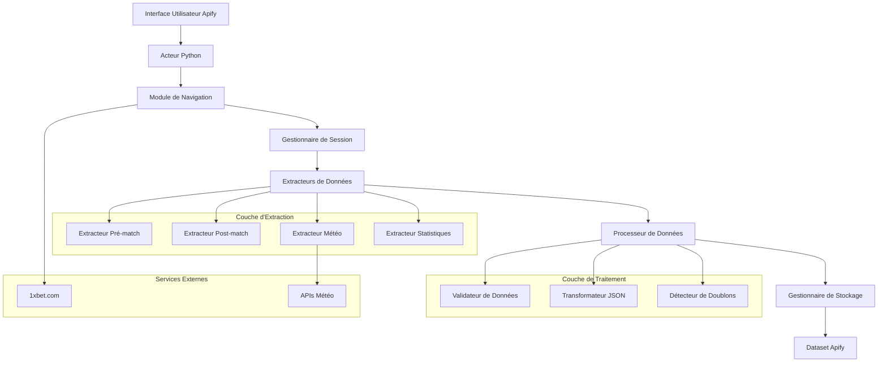
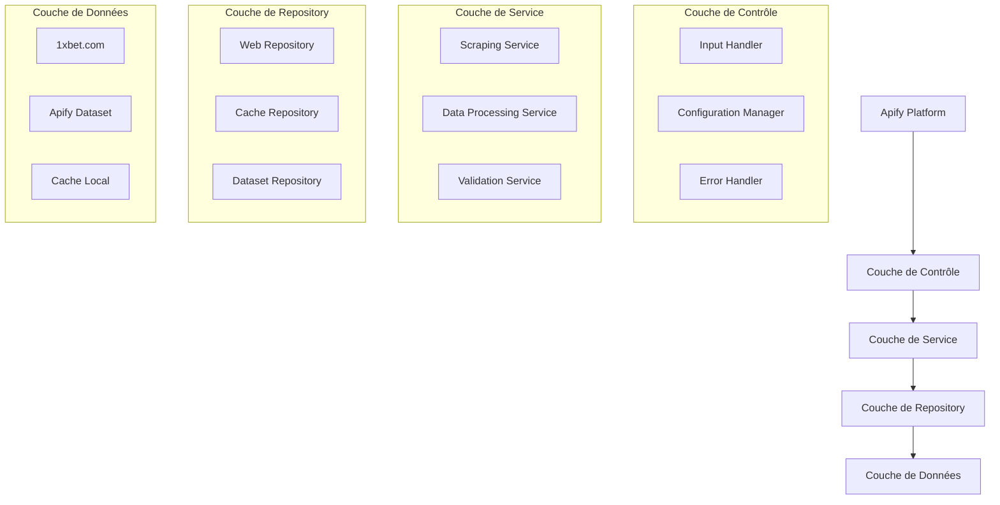
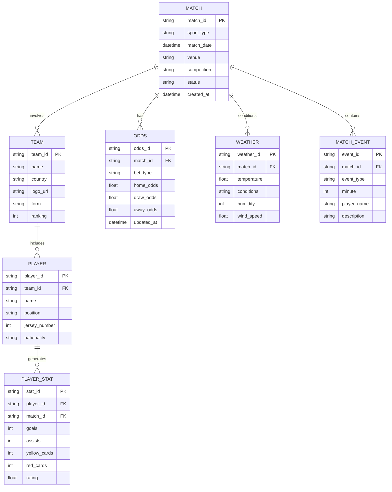

# Architecture Technique - Acteur Apify 1xbet Scraper

## 1. Conception de l'architecture



## 2. Description des technologies

* **Runtime** : Python 3.11+ avec Apify SDK

* **Navigation** : Playwright pour gestion JavaScript et contenu dynamique

* **Parsing** : BeautifulSoup4 + lxml pour extraction HTML

* **Gestion HTTP** : httpx pour requêtes asynchrones

* **Validation** : Pydantic pour validation des schémas de données

* **Stockage** : Apify Dataset pour persistance des données

* **Monitoring** : Apify SDK logging intégré

## 3. Définitions des routes

| Route                          | Objectif                                  |
| ------------------------------ | ----------------------------------------- |
| /sports/{sport\_id}            | Page principale d'un sport spécifique     |
| /sports/{sport\_id}/live       | Événements en cours pour un sport         |
| /sports/{sport\_id}/line       | Événements à venir (pré-match)            |
| /sports/{sport\_id}/results    | Résultats des matchs terminés             |
| /sports/{sport\_id}/statistics | Statistiques détaillées par équipe/joueur |
| /weather/{match\_id}           | Conditions météorologiques pour un match  |

## 4. Définitions des APIs internes

### 4.1 APIs principales

**Extraction des données pré-match**

```python
class PreMatchExtractor:
    async def extract_match_data(match_id: str) -> PreMatchData
```

Paramètres d'entrée :

| Nom du paramètre | Type    | Requis | Description                            |
| ---------------- | ------- | ------ | -------------------------------------- |
| match\_id        | string  | true   | Identifiant unique du match            |
| sport\_type      | string  | true   | Type de sport (football, tennis, etc.) |
| include\_weather | boolean | false  | Inclure les données météorologiques    |
| include\_lineups | boolean | false  | Inclure les compositions d'équipes     |

Réponse :

| Nom du paramètre | Type              | Description                            |
| ---------------- | ----------------- | -------------------------------------- |
| match\_info      | MatchInfo         | Informations générales du match        |
| teams            | List\[TeamInfo]   | Détails des équipes participantes      |
| odds             | OddsData          | Cotes et probabilités                  |
| weather          | WeatherInfo       | Conditions météorologiques (optionnel) |
| lineups          | List\[PlayerInfo] | Compositions d'équipes (optionnel)     |

Exemple :

```json
{
  "match_id": "12345",
  "sport_type": "football",
  "match_info": {
    "date": "2024-01-15T20:00:00Z",
    "venue": "Stade de France",
    "competition": "Ligue 1"
  },
  "teams": [
    {
      "name": "Paris Saint-Germain",
      "form": "WWDWW",
      "ranking": 1
    }
  ]
}
```

**Extraction des données post-match**

```python
class PostMatchExtractor:
    async def extract_result_data(match_id: str) -> PostMatchData
```

Paramètres d'entrée :

| Nom du paramètre | Type    | Requis | Description                         |
| ---------------- | ------- | ------ | ----------------------------------- |
| match\_id        | string  | true   | Identifiant unique du match         |
| include\_events  | boolean | false  | Inclure les événements du match     |
| include\_stats   | boolean | false  | Inclure les statistiques détaillées |

Réponse :

| Nom du paramètre | Type                | Description            |
| ---------------- | ------------------- | ---------------------- |
| final\_score     | ScoreInfo           | Score final du match   |
| match\_events    | List\[EventInfo]    | Événements marquants   |
| statistics       | MatchStatistics     | Statistiques complètes |
| player\_ratings  | List\[PlayerRating] | Notes des joueurs      |

## 5. Architecture serveur



## 6. Modèle de données

### 6.1 Définition du modèle de données



### 6.2 Langage de définition des données

**Schéma de configuration d'entrée**

```python
from pydantic import BaseModel
from typing import List, Optional
from datetime import datetime

class ScrapingConfig(BaseModel):
    sports: List[str] = ["football", "tennis", "basketball"]
    start_date: datetime
    end_date: datetime
    include_pre_match: bool = True
    include_post_match: bool = True
    include_weather: bool = False
    max_matches_per_sport: int = 100
    delay_between_requests: float = 1.0
```

**Schéma des données de match**

```python
class MatchData(BaseModel):
    match_id: str
    sport_type: str
    match_date: datetime
    venue: Optional[str]
    competition: str
    status: str  # "upcoming", "live", "finished"
    teams: List[TeamInfo]
    odds: Optional[OddsData]
    weather: Optional[WeatherInfo]
    events: Optional[List[MatchEvent]]
    statistics: Optional[MatchStatistics]
    
class TeamInfo(BaseModel):
    team_id: str
    name: str
    country: Optional[str]
    logo_url: Optional[str]
    form: Optional[str]  # "WWDLW"
    ranking: Optional[int]
    
class OddsData(BaseModel):
    home_win: float
    draw: Optional[float]
    away_win: float
    over_under: Optional[dict]
    updated_at: datetime
```

**Initialisation des structures de données**

```python
# Configuration par défaut
DEFAULT_CONFIG = {
    "sports": ["football"],
    "max_matches_per_sport": 50,
    "delay_between_requests": 2.0,
    "include_weather": False,
    "respect_robots_txt": True,
    "user_agent": "Apify 1xbet Scraper 1.0"
}

# Headers HTTP recommandés
DEFAULT_HEADERS = {
    "User-Agent": "Mozilla/5.0 (Windows NT 10.0; Win64; x64) AppleWebKit/537.36",
    "Accept": "text/html,application/xhtml+xml,application/xml;q=0.9,*/*;q=0.8",
    "Accept-Language": "fr-FR,fr;q=0.8,en-US;q=0.5,en;q=0.3",
    "Accept-Encoding": "gzip, deflate",
    "Connection": "keep-alive",
    "Upgrade-Insecure-Requests": "1"
}
```

