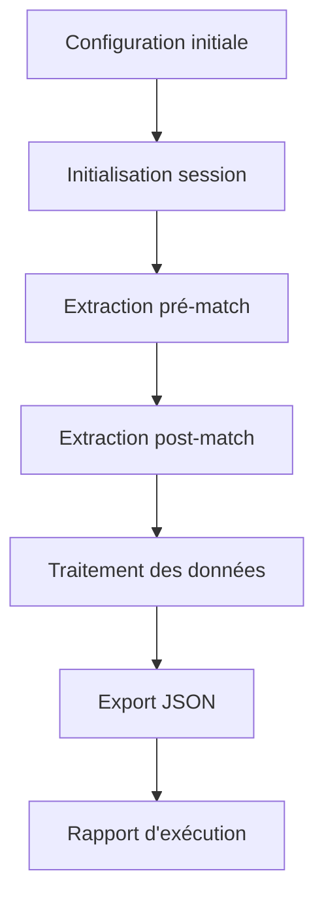

# Cahier des Charges - Acteur Apify pour 1xbet.com

## 1. Vue d'ensemble du projet

Développement d'un acteur Apify spécialisé pour extraire automatiquement les données sportives du site 1xbet.com, couvrant les informations pré-match et post-match pour différents sports et compétitions.

L'acteur permettra aux utilisateurs d'obtenir des données structurées et précises pour l'analyse sportive, les paris, ou la recherche statistique.

Objectif : Créer une solution robuste et configurable pour l'extraction de données sportives à grande échelle.

## 2. Fonctionnalités principales

### 2.1 Rôles utilisateur

| Rôle | Méthode d'accès | Permissions principales |
|------|-----------------|------------------------|
| Utilisateur Standard | Configuration via interface Apify | Peut extraire des données de base, limité à 100 matchs par exécution |
| Utilisateur Premium | Clé API avancée | Accès complet, extraction illimitée, données historiques étendues |

### 2.2 Modules fonctionnels

Notre acteur 1xbet comprend les pages principales suivantes :

1. **Configuration d'entrée** : paramètres de scraping, sélection des sports, filtres temporels
2. **Extraction pré-match** : collecte des données avant les événements sportifs
3. **Extraction post-match** : collecte des résultats et statistiques après les matchs
4. **Gestion des données** : structuration, validation et export des données
5. **Monitoring et logs** : suivi des performances et gestion des erreurs

### 2.3 Détails des pages

| Nom de la page | Nom du module | Description des fonctionnalités |
|----------------|---------------|----------------------------------|
| Configuration d'entrée | Interface de paramétrage | Configurer les sports cibles, définir les plages de dates, sélectionner les types de données à extraire, définir les limites de pagination |
| Extraction pré-match | Collecteur de données avant-match | Extraire les détails des équipes, récupérer les cotes en temps réel, collecter les statistiques historiques, obtenir les compositions d'équipes, récupérer les conditions météorologiques |
| Extraction post-match | Collecteur de résultats | Extraire les scores finaux, collecter les statistiques détaillées du match, récupérer les événements marquants, analyser les performances individuelles, extraire les commentaires d'experts |
| Gestion des données | Processeur de données | Valider la cohérence des données, structurer en format JSON, détecter et gérer les doublons, appliquer les transformations nécessaires |
| Monitoring et logs | Système de surveillance | Suivre les performances de scraping, gérer les erreurs et exceptions, respecter les limites de taux, générer des rapports d'exécution |

## 3. Processus principal

### Flux utilisateur standard

1. L'utilisateur configure les paramètres d'extraction (sports, dates, types de données)
2. L'acteur initialise la session de scraping avec gestion des cookies et headers
3. Navigation vers les sections pré-match pour collecter les données avant événements
4. Extraction des données post-match pour les événements terminés
5. Traitement et structuration des données collectées
6. Export des résultats en format JSON structuré
7. Génération du rapport d'exécution avec statistiques

## 4. Design de l'interface utilisateur

### 4.1 Style de design

- **Couleurs principales** : Bleu foncé (#1a365d) et vert accent (#38a169)
- **Couleurs secondaires** : Gris clair (#f7fafc) pour les arrière-plans
- **Style des boutons** : Boutons arrondis avec effet de survol
- **Police** : Inter, tailles 14px pour le texte, 18px pour les titres
- **Style de mise en page** : Interface basée sur des cartes avec navigation latérale
- **Icônes** : Style minimaliste avec icônes de sport reconnaissables

### 4.2 Aperçu du design des pages

| Nom de la page | Nom du module | Éléments UI |
|----------------|---------------|-------------|
| Configuration d'entrée | Formulaire de paramètres | Interface en cartes avec sélecteurs déroulants pour sports, calendriers pour dates, cases à cocher pour types de données, curseurs pour limites |
| Extraction pré-match | Tableau de données | Grilles responsives avec colonnes triables, indicateurs de progression, badges colorés pour statuts des équipes |
| Extraction post-match | Visualisation des résultats | Cartes de résultats avec scores mis en évidence, graphiques de statistiques, timeline des événements |
| Gestion des données | Console de traitement | Barres de progression pour validation, aperçu JSON avec coloration syntaxique, compteurs de données traitées |
| Monitoring et logs | Dashboard de surveillance | Graphiques en temps réel, alertes colorées pour erreurs, métriques de performance avec jauges |

### 4.3 Responsivité

L'interface est conçue desktop-first avec adaptation mobile complète, optimisée pour les interactions tactiles sur tablettes et smartphones.